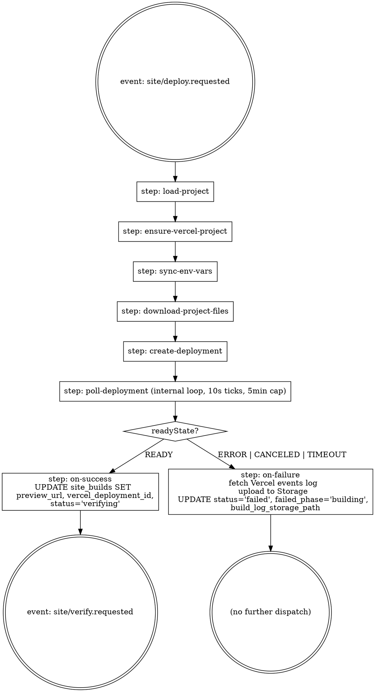

# JAB SaaS v2 — Phase D: Build & Deploy — Design Spec

> **Status:** DRAFT (2026-05-28)
> **Stage:** 4 of 7 — per [`docs/superpowers/plans/2026-05-25-saas-v2-roadmap.md`](../plans/2026-05-25-saas-v2-roadmap.md)
> **Architecture reference:** [`docs/saas-v2-component-pipeline.md`](../../saas-v2-component-pipeline.md) §4 Phase D, §6.7
> **Predecessor:** Phase C — Compose & Shell (shipped 2026-05-28, validated on Two Roads build `982f0d57`)
> **Successor:** Phase E — Verify (output-vs-source fidelity scoring); Phase F — Review & Publish gate (binds `<slug>.<apex>` subdomain on approve)

---

## 0. Why this exists

Phase C has produced a complete Next.js project tree in Supabase Storage at `builds/<id>/project/` — `package.json`, the SDK, the dispatcher, downloaded block components, the LLM-generated Header + Footer, sitemap + robots, the catch-all dynamic route. None of that is useful until something runs `pnpm install && pnpm build` against it and pushes the output to a URL.

Phase D is the bridge from **file artifacts in Storage** to **a live, screenshotable URL** that Phase E can verify and Phase F can put in front of a human. It is the first phase where JAB-the-platform crosses a billing boundary (each build costs ~$0.40 of Vercel build minutes plus storage egress) and the first phase that fails for reasons we can't fully control — DNS hiccups, Vercel API rate limits, npm registry timeouts, customer WP credentials gone bad.

**Design pressure:** we never run customer-derived code on our own infra. Vercel runs it. Our worker is a courier — it materializes the project, calls Vercel's REST API, polls for completion, captures logs on failure, and updates state. Everything that could be exploited by a maliciously-crafted block ends up inside Vercel's sandbox, not ours.

---

## 1. Goal

Given a completed Phase C build (`site_builds` row with `status = 'building'`, full project tree at `builds/<id>/project/` in Storage, `projects.wp_url` + `wp_username` + `wp_app_password_encrypted` populated), deploy to Vercel and capture a working preview URL on `site_builds.preview_url`.

Success = Phase E can navigate a real browser to the captured URL and screenshot the rendered pages, and `site_builds.status` reflects `verifying` (success) or `failed` (with logs reachable via UI).

---

## 2. Inputs

| Source | Shape | Used for |
|---|---|---|
| `site_builds[id]` | `{ status, project_id, config }` | Status transitions; tenant scoping via FK; `config.deploy_timeout_ms` override |
| `projects[id]` | `{ name, wp_url, wp_username, wp_app_password_encrypted, vercel_project_id }` | Vercel project lazy-creation + env-var sync |
| Storage: `builds/<id>/project/**` | UTF-8 source files (encoded Next.js dynamic-route directories per Phase C contract) | Vercel deployment file body |

**What Phase D deliberately does NOT consume:** screenshots from Phase A (Phase E uses those), shell prompt artifacts, the block inventory. Phase D is the most "narrow inputs, narrow outputs" phase in the v2 pipeline.

**Implicit input:** the encoding contract from Phase C — `__catchall_X__` ↔ `[...X]`, `__optcatchall_X__` ↔ `[[...X]]`, `__dynamic_X__` ↔ `[X]`. Phase D reverses these in-memory before sending file paths to Vercel.

---

## 3. Outputs

### 3a. Vercel side

- One Vercel project per JAB project. Name slug is `projects.name` lower-cased + dash-cased (`compose-site-emit.ts`'s `emitPackageJson()` already does this — Phase D mirrors).
- One Vercel deployment per `site_builds` row, on the `production` target. Vercel mints a `<slug>-<hash>.vercel.app` URL.
- Three Vercel env vars on the project (production target only): `WP_URL`, `WP_USER`, `WP_APP_PASSWORD`. Re-synced on every Phase D run since customer credentials might have rotated.

### 3b. Our side — Schema additions

```sql
-- Migration 0022_phase_d_deploy.sql
ALTER TABLE public.projects
  ADD COLUMN vercel_project_id TEXT,
  ADD COLUMN vercel_project_name TEXT;

ALTER TABLE public.site_builds
  ADD COLUMN preview_url TEXT,
  ADD COLUMN vercel_deployment_id TEXT,
  ADD COLUMN build_log_storage_path TEXT;
```

**Why no schema changes for `projects.live_url`:** that promotion lives in Phase F (the review + publish gate). Phase D just records `site_builds.preview_url`. Phase F reads it.

**Why no `failed_phase`-specific column:** `site_builds.failed_phase` already exists from 0014 with the value `'building'` in its CHECK set.

### 3c. Storage

- Build logs on failure: `builds/<id>/build-log.txt` (plain text concatenation of Vercel deployment events). `text/plain` MIME, fits the bucket allowlist.
- Build logs on success: not stored. Vercel keeps them on their side, retrievable via API if a debugger wants to dig in. Storing successful build logs would be a quiet $$/byte cost with low operator value.

---

## 4. Architecture & worker sequencing



**Why mostly serial:** Phase D's parallelism story is weaker than Phase B/C. Each step depends on the previous (project ID → env sync → file upload → deployment create). Trying to parallelize `download-project-files` with `ensure-vercel-project` saves maybe 1s out of a 90s build — not worth the step-graph complexity.

The one parallel opportunity is `sync-env-vars` and `download-project-files` — both depend on `ensure-vercel-project` but not on each other. We do parallelize those two via `Promise.all([step.run(...), step.run(...)])` (same pattern as Phase C's Wave 2).

**`retries: 0`:** same rationale as discoverSite/generateComponents/composeSite — `failed_phase: 'building'` is the durable failure surface. Inngest auto-retry would create duplicate Vercel deployments. The UI's "Build again" button is the retry mechanism.

---

## 5. Vercel API contract

Phase D talks to three Vercel REST endpoints. All requests carry `Authorization: Bearer ${VERCEL_TOKEN}` and `?teamId=${VERCEL_TEAM_ID}` query param.

| Endpoint | Method | When | Purpose |
|---|---|---|---|
| `/v10/projects` | `POST` | First Phase D run for a `projects[id]` | Create Vercel project. Body: `{ name, framework: "nextjs" }`. Response: `{ id, name }` → persist as `projects.vercel_project_id`, `projects.vercel_project_name`. |
| `/v9/projects/{id}/env` | `GET` | Every Phase D run | List existing env vars to decide upsert vs create. |
| `/v9/projects/{id}/env` | `POST` | When key absent | Add env var: `{ key, value, type: "encrypted", target: ["production"] }`. |
| `/v9/projects/{id}/env/{envId}` | `PATCH` | When key present | Replace value: `{ value, type: "encrypted", target: ["production"] }`. |
| `/v13/deployments` | `POST` | Once per Phase D run | Create deployment. Body: `{ name, files: [{ file, data, encoding }...], projectSettings: { framework: "nextjs" }, target: "production", project: vercel_project_id }`. Response: `{ id, url, readyState }`. |
| `/v13/deployments/{id}` | `GET` | Every poll tick | Read `readyState`. |
| `/v3/deployments/{id}/events` | `GET` | On failure | Fetch build log events for upload to our Storage. |

**File body encoding:** UTF-8 text files get `{ file: "package.json", data: "...string...", encoding: "utf-8" }`. Binary or large files would need the SHA-upload flow (`POST /v2/files` first, reference SHAs in deployment body) — but the JAB-emitted project is ~50 text files totaling well under 200KB, so inline body is fine. We add a guard: if total file body exceeds 4MB, the worker hard-fails with a clear error message pointing at the SHA-upload migration path. v1 won't hit this; v2 SDK growth might.

**Project creation idempotency:** the create call is wrapped in `if (!project.vercel_project_id) ...`. The Vercel side errors with `400` if a project with the same name already exists in the team — we catch that, fetch the matching project ID via `GET /v9/projects?search={name}`, persist, and continue. This makes the create step safe to re-run if our DB and Vercel diverge.

---

## 6. The file-tree download + decode step

The single trickiest step in the worker. Pseudocode:

```ts
const files = await step.run("download-project-files", async () => {
  const supabase = createAdminClient();
  const prefix = `builds/${buildId}/project/`;
  const { data: objects, error } = await supabase.storage
    .from(SITE_SCREENSHOTS_BUCKET)
    .list(prefix, { limit: 500 });
  if (error) throw new Error(`list-project-files failed: ${error.message}`);

  const collected: { file: string; data: string; encoding: "utf-8" }[] = [];
  for (const obj of objects) {
    if (obj.metadata?.size === 0) continue;
    const objPath = `${prefix}${obj.name}`;
    const { data: blob, error: dlErr } = await supabase.storage
      .from(SITE_SCREENSHOTS_BUCKET)
      .download(objPath);
    if (dlErr || !blob) throw new Error(`download ${obj.name} failed: ${dlErr?.message}`);
    const text = await blob.text();
    // Reverse Phase C's encoding for Vercel-side file paths
    const decoded = obj.name
      .replace(/__optcatchall_([A-Za-z0-9_]+)__/g, "[[...$1]]")
      .replace(/__catchall_([A-Za-z0-9_]+)__/g, "[...$1]")
      .replace(/__dynamic_([A-Za-z0-9_]+)__/g, "[$1]");
    collected.push({ file: decoded, data: text, encoding: "utf-8" });
  }
  return collected;
});
```

**Recursion gotcha:** Supabase Storage's `list` is shallow. We need recursive enumeration to walk `app/__catchall_slug__/page.tsx` and similar nested paths. Implementation: recursive `list` with `prefix` per subdirectory, or a flat `list` with `search: ""` over the full prefix tree. The recursive approach is more predictable — we'll iterate explicit prefixes for `app/`, `components/`, `lib/`, etc. See §11 task breakdown.

**Memoization:** Inngest serializes step.run outputs as JSON for replay-safe retries. Two Roads' project is ~150KB → ~200KB base64 in JSON. Well within Inngest's per-step payload limit (~5MB on the cloud, similar locally). If a future site exceeds the limit we move to streaming: have `download-project-files` return file paths only, then `create-deployment` re-downloads inside its own step.

---

## 7. Failure modes

| Failure | Detection | Outcome |
|---|---|---|
| Vercel API non-2xx (auth, rate limit, validation) | HTTP status check on each API call | Throw with `vercel-api: ${endpoint} → ${status}: ${body.error.message}`. Inngest captures the throw; worker dies; `site_builds.status` stays `building`; operator sees stuck-build in UI. v1.1 may add a status='failed' grace-fall for clarity. |
| Vercel deployment ERROR / CANCELED | `readyState` in poll loop | Fetch events log via `/v3/deployments/.../events`, concat text, upload to `builds/<id>/build-log.txt`. UPDATE `site_builds`: `status='failed'`, `failed_phase='building'`, `build_log_storage_path=...`. No verify event dispatched. |
| Poll timeout (>5 min) | Internal poll loop attempt count | Same as deployment ERROR — capture partial logs, mark failed. |
| File-tree download incomplete (e.g. Phase C ran partially) | After `download-project-files`, assert critical files present (`package.json`, `app/page.tsx`, `app/layout.tsx`) | Hard-fail with explicit list of missing files. Phase D should not paper over a malformed Phase C output. |
| WP creds invalid (decryption fails, or WP rejects them at build time) | Build will fail with Next.js trying to call WP at build time. Surfaces via Vercel build log. | Same as deployment ERROR path. Operator action: re-run `connectWp`, then rebuild. |
| Vercel project deletion (operator deleted from Vercel UI) | Project ensure step gets 404 on existing `vercel_project_id` | Catch, null out `projects.vercel_project_id`, recreate. Belt-and-suspenders since it shouldn't happen, but cheap. |

---

## 8. Telemetry

Each Phase D worker run emits one structured log line at completion. Suggested shape:

```json
{
  "buildId": "...",
  "projectId": "...",
  "vercelDeploymentId": "dpl_...",
  "previewUrl": "tworoads-bxk2j9.vercel.app",
  "phaseDurationMs": 94000,
  "vercelBuildDurationMs": 78000,
  "fileCount": 50,
  "totalBytes": 152000,
  "outcome": "ready" | "failed",
  "failureReason": null | "vercel-error" | "timeout" | "incomplete-tree"
}
```

Stored as a console.log line in the Inngest worker output. Future Phase G observability work can promote this to a `phase_d_runs` table; for v1, structured stdout is enough.

---

## 9. Risks + open questions

| # | Risk | Mitigation |
|---|---|---|
| R1 | Vercel REST API surface changes underneath us | Pin API versions explicitly (`/v10`, `/v13`) in URLs; one wrapper module (`lib/vercel/client.ts`) so a future version bump is a single-file change. |
| R2 | Per-build cost ($0.40 build minute, storage egress) grows quickly if rebuilds spam | v1 has no rate limit on builds. Phase G will add a per-tenant daily-build cap with an override flag. |
| R3 | Env var rotation: changing customer WP password breaks future ISR revalidations | Every Phase D run re-syncs the 3 env vars. Customer rotates app password → next build picks it up. ISR between builds will fail until a new build runs. Acceptable for v1. |
| R4 | The 4MB inline-file-body ceiling | Guard rail in `download-project-files` step. Above 4MB, hard-fail with a switch-to-sha-upload hint. v1 projects are well under this. |
| R5 | Concurrent Phase D runs for the same `projects[id]` produce two Vercel deployments racing | We don't lock at the application layer in v1. Vercel handles two concurrent deploys to the same project gracefully — last one wins on the `production` alias. UI button-disable prevents the common-case double-click. |
| R6 | Plan-time decision on Vercel deployment polling interval | 10s ticks chosen as the v1 default — Vercel cold builds typically take 60-180s, so 10s ticks balances responsiveness against API call count. Configurable per build via `site_builds.config.deploy_timeout_ms` if a pathologically slow build needs it. |
| OQ1 | **Open question** — how do we surface in-progress build state in the UI? Phase E + F overlap with this. Resolve in Stage 5 design. |
| OQ2 | **Open question** — what happens if Vercel's webhook for deployment-ready fires before our poll-loop sees READY? Webhooks are not used in v1 (poll-only) so this is a non-issue until we add webhooks in v2. |

---

## 10. v1 scope cuts (deferred to Phase F or later)

- **Custom subdomain attachment** (`<slug>.<apex>`) — Phase F binds the apex on approve. Phase D records the raw `vercel.app` URL only.
- **`projects.live_url` promotion** — Phase F's publish action sets this.
- **Rollback to previous successful build** — no rollback in v1. Per the brainstorming decision: bad build → fix root cause → click Build again. The Phase F review gate is the safety net.
- **Webhook-driven build completion** — poll-only in v1. Inngest functions are short-lived enough that a 3-5 min poll is OK; webhooks add an external-state-machine surface we don't need yet.
- **Multi-region deploy / custom Vercel regions** — Vercel's default region per project is fine.
- **Build log streaming to UI in real-time** — UI shows final log on failure only. Live tail is a Stage 7 polish.

---

## 11. Task breakdown sketch (input to the writing-plans skill)

Roughly 14-16 TDD tasks expected. High-level groupings:

1. **Schema (Tasks 1-2)** — migration 0022 + schema.ts mirror.
2. **Vercel client wrapper (Tasks 3-5)** — `lib/vercel/client.ts` with `createProject`, `findProjectByName`, `listEnvVars`, `upsertEnvVar`, `createDeployment`, `getDeployment`, `getDeploymentEvents`. Each public method gets a test against a fetch-mocked instance.
3. **Project-tree download + decode (Tasks 6-7)** — `lib/jab/download-project-tree.ts` with the recursive Storage list, `decodeNextDynamicSegments` helper (mirror of Phase C's encode), and the assert-required-files guard. Tests use a tmp-bucket fixture.
4. **Deployment polling helper (Task 8)** — `lib/vercel/poll-deployment.ts` with abortable interval loop, configurable timeout.
5. **Inngest worker `deploy-site.ts` (Tasks 9-12)** — wire everything together via step.run sequencing. Each task adds one step boundary with its test. Mock the Vercel client; only the smoke runner exercises live Vercel.
6. **Build log capture (Task 13)** — fetch events on failure path, concat to text, upload to Storage with the same 3-attempt retry pattern as persist-shell-generation.
7. **Smoke runner (Task 14)** — `scripts/smoke-deploy-site.ts`: takes `projectId tenantId buildId`, dispatches `site/deploy.requested`, polls `site_builds.status` until `verifying` or `failed`, asserts `preview_url` is a valid URL, optionally HEAD-checks it returns 200. Documents real-cost (~$0.40 + Vercel build minutes).
8. **Vercel one-time setup runbook (Task 15)** — `docs/superpowers/operator/2026-05-28-vercel-platform-setup.md`: how to provision the JAB Vercel team, mint a service token with the right scope, set `VERCEL_TOKEN` + `VERCEL_TEAM_ID` env vars in `.env.local` and on the production worker host.
9. **CLAUDE.md + roadmap update (Task 16)** — bump Stage 4 status, document the Vercel platform dependency.

---

## 12. What changes for the SDK / runtime side?

Nothing in this phase. The emitted project's `lib/sdk/`, `lib/jab/client.ts`, and runtime helpers were already laid down in Phase C. Phase D just builds and ships what Phase C wrote.

The one tiny touch-point: `compose-site-emit.ts:emitReadmeMd()` currently includes a "Phase D will deploy this" forward-reference in the boilerplate README. Once Phase D ships, we'd update that copy to point at the live Site Detail page instead of a TODO. Not blocking.

---

## 13. Done = …

- `pnpm smoke:deploy <projectId> <tenantId> <buildId>` against the Two Roads `982f0d57` build produces a `site_builds.preview_url` like `tworoads-brewing-new-<hash>.vercel.app`, returns HTTP 200, and renders the homepage with at least the Header + a hero block.
- A deliberately-broken project (introduce a tsc error into a downloaded component file via direct Storage edit, re-trigger Phase D) produces `status='failed'`, `failed_phase='building'`, and a `build_log_storage_path` whose content includes the tsc error verbatim.
- `pnpm vitest run` is green across the new tests.
- `tsc --noEmit` is clean.
- One end-to-end happy-path screenshot of `https://<preview_url>/` rendering correctly is captured for the PR.
